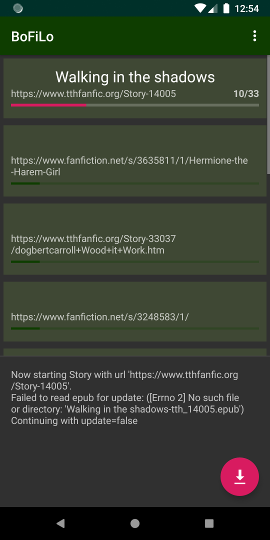
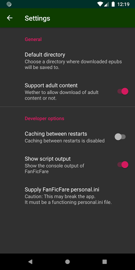

# BoFiLo (Book Fiction Loader)

A Android frontend for https://github.com/JimmXinu/FanFicFare

Download apk from [ releases](https://github.com/Octav14n/BoFiLo/releases), if you don't know which Version matches your device, use the one ending in "...-universal-release.apk"

## How to use this App

1. Go to "Settings" and choose where to store your Epub files
2. Use your web-browser to find a Story you want to download and use the "Share" option to open the story url with BoFiLo.

### Usage hints:

- For "Default folder" use some folder in "internal storage" or use "downloads" for best speed
- If no "Default folder" is supplied all Epubs will be saved in the "cache" directory of the app.
- The Icon in the bottom right of the main screen starts downloading Epubs for testing purposes

## Screenshots

### For Developers:

to be able to interact between Kotlin(/Java) and Python [Chaquopy](https://chaquo.com/chaquopy/) is used\
the access to FanFicFare happens in [helper.py](app/src/main/python/helper.py).

the interaction between Kotlin and Python happens in:

- [StoryDownloadService.kt](app/src/main/java/eu/schnuff/bofilo/download/StoryDownloadService.kt) (reading of personal.ini and changedir)
- [StoryDownloadHelper.kt](app/src/main/java/eu/schnuff/bofilo/download/StoryDownloadHelper.kt) (calling "start" function in python and interacting with the script)